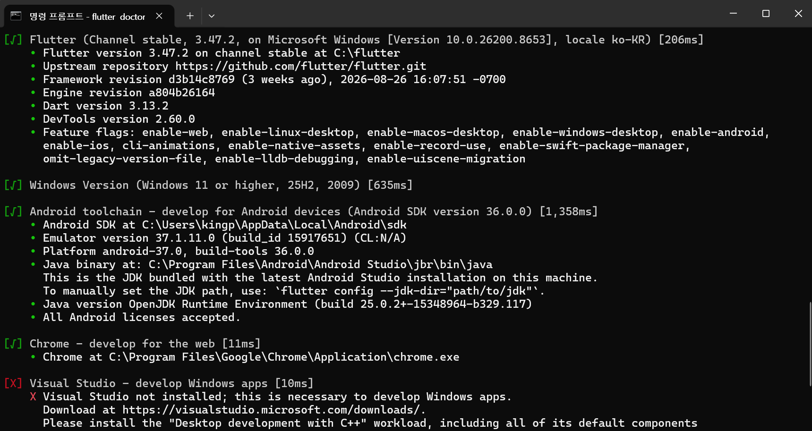
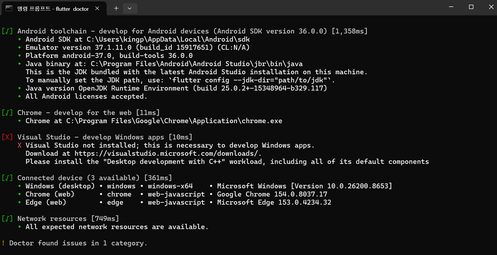
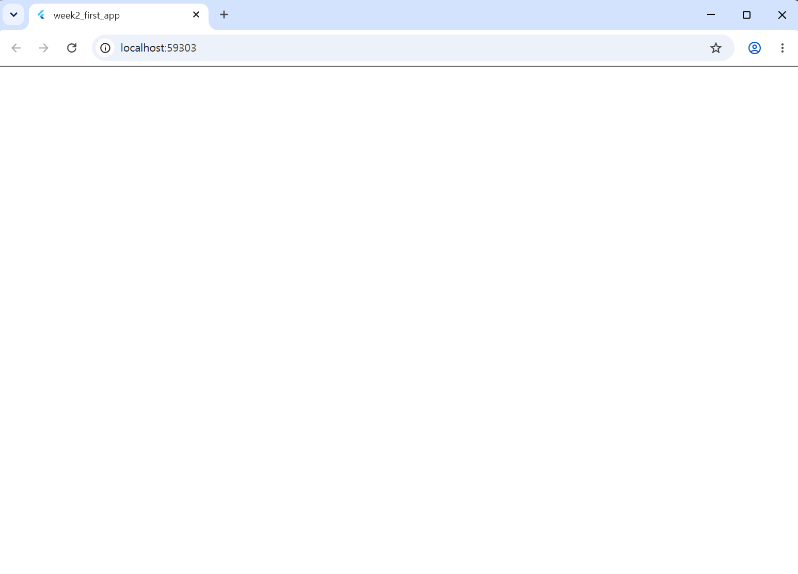
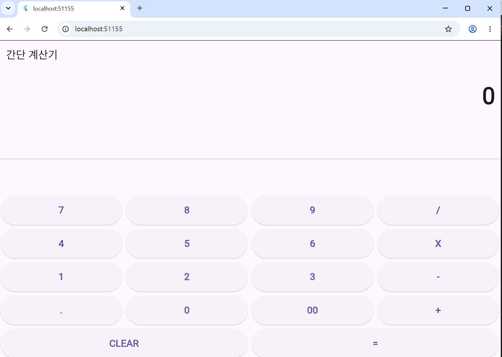

# Flutter·Dart 개발환경 구성

## 1. 개발환경 체크리스트 (`flutter doctor -v`)

- **`flutter doctor -v` 실행 결과 (상세)**:




---

## 2. 오류 및 해결 과정

`flutter doctor`를 실행하여 개발환경을 확인한 결과, `Android toolchain` 항목에서 Android SDK 관련 오류가 발생하였습니다.

- **원인**: Android 개발에 필요한 SDK 및 Command-line Tools가 설치되어 있지 않았기 때문입니다.
- **해결 방법**:
  1. Android Studio의 `SDK Manager`에서 Android SDK, Build-Tools, Platform-Tools, Command-line Tools를 설치하였습니다.
  2. 명령 프롬프트(CMD)에서 아래 명령어를 수행하여 Android 라이선스 동의를 완료하였습니다.
     ```bash
     flutter doctor --android-licenses
     ```

---

## 3. 첫 앱 실행 화면 및 사용 Device

- **사용한 Device**: Chrome (Web)
- **앱 실행 증거**:



- **결과**: Chrome 브라우저 환경에서 첫 Flutter 기본 앱이 성공적으로 실행됨을 확인하였습니다.

---

## 4. 응용 과제: 간단 계산기 구현

- **구현 내용**: AI를 활용하여 Flutter 기반 사칙연산 계산기 UI 및 계산 로직 구현
- **사용한 Device**: Chrome (Web)
- **앱 실행 증거**:



# Flutter·Dart (`StudyGoal` 앱)

## 1. 수용 조건(AC) 검증 증거 자료 (`evidence/`)

- **`evidence/ac1-valid.png` (정상 입력)**:
  - 입력창에 `Dart 객체지향` 입력 후 추가하여 목록 및 `미완료` 상태가 정상 표시됨.


- **`evidence/ac2-empty.png` (공백 입력 오류)**:
  - 빈 값 입력 후 추가 클릭 시 차단되며 `목표를 입력하세요` 오류 문구가 표시됨.


- **`evidence/ac3-complete.png` (완료 전환)**:
  - 항목 선택 시 체크박스가 활성화되고 텍스트가 `완료` 상태로 변경됨.


---

## 2. 주요 구현 사항 및 해결 과정

- **요구사항 명세 작성 (`FEATURE_CONTEXT.md`)**:
  - 사용자 스토리, 기능 구현 범위(Scope), 수용 조건(AC1~AC3)을 구체화하여 명세서 파일 작성 완료.
- **핵심 기능 구현 (`lib/main.dart`)**:
  - `_toggleGoal` 상태 로직 구현으로 완료/미완료 전환 처리.
  - 공백 입력에 대한 폼 검증(Validation) 처리로 예외 케이스 방지.
- **테스트 코드 오류 해결 (`test/widget_test.dart`)**:
  - 기존 샘플 앱(`MyApp`) 기반 테스트 코드를 새로 구현한 `StudyGoalApp`에 맞게 수정하여 `flutter analyze` 정적 분석 0건(No issues found!) 달성.

---

## 3. 앱 실행 및 정적 분석 결과

- **사용한 Device**: Chrome (Web)
- **정적 분석 결과**:
  ```bash
  flutter analyze
  # Analyzing week3_goal_lab...
  # No issues found!